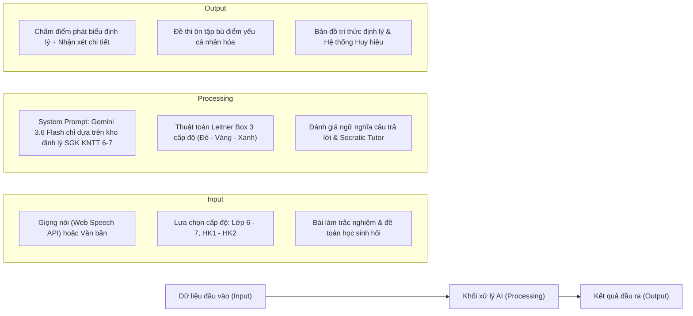

# 📐 VUI HỌC TOÁN – MATHMIND AI
## Trợ Lý AI Ôn Thi & Ghi Nhớ Định Lý Toán 6–7 (Bộ Sách Kết Nối Tri Thức Với Cuộc Sống)
*(Dự án tham dự Cuộc thi AI Phục vụ học tập - Bảng A THCS)*

---

## 🌟 1. GIỚI THIỆU TỔNG QUAN
- **Tên ứng dụng:** **Vui Học Toán (MathMind AI)**
- **Mục tiêu:** Giúp học sinh THCS lớp 6 và lớp 7 khắc phục triệt để tình trạng hay quên, nhầm lẫn các định lý hình học và công thức đại số quan trọng trong bộ sách Kết nối tri thức; bứt phá điểm số trong các kì thi Giữa kì & Cuối kì.
- **Phương pháp cốt lõi:**
  1. **Thuật toán lặp lại ngắt quãng Leitner (Spaced Repetition):** Phân loại định lý vào 3 hộp (Hộp Đỏ - Cần ôn gấp; Hộp Vàng - Còn lúng túng; Hộp Xanh - Đã thuộc làu).
  2. **Gia sư Socratic AI:** Tuyệt đối không giải hộ bài, mà chỉ hỏi gợi mở, giúp học sinh tự xây dựng tư duy từ Giả thiết $\rightarrow$ Vận dụng định lý $\rightarrow$ Kết luận.
  3. **Bảo mật tuyệt đối Gemini API Key:** API Key được giữ tại máy chủ backend hoặc Vercel Serverless Function, không bao giờ lộ ra ngoài trình duyệt của người dùng.

---

## 🏗️ 2. QUY TRÌNH AI CỐT LÕI (INPUT ➔ PROCESSING ➔ OUTPUT)

---

## 📱 3. BỐN PHÂN HỆ CHỨC NĂNG

### Phân hệ 1: Trạm Thử Thách & Ghi Nhớ Định Lý
- **Flashcard 3D lật thẻ thông minh:** Mặt trước minh họa trực quan SVG; mặt sau là phát biểu chuẩn SGK, Giả thiết - Kết luận và Công thức KaTeX.
- **Thuật toán hộp Leitner:** Đánh dấu độ thuộc định lý (Đỏ, Vàng, Xanh) tự động lưu trên `localStorage`.
- **Thử thách Điền vào chỗ trống:** Kiểm tra độ hiểu sâu các từ khóa và điều kiện quan trọng.
- **Vấn đáp cùng AI (Hỗ trợ giọng nói Web Speech API):** Học sinh nói hoặc gõ câu trả lời, AI đối chiếu ngữ nghĩa với SGK và chấm điểm chi tiết.
- **Thư viện Định lý bỏ túi:** Tra cứu nhanh với bộ lọc lớp, học kì và phân môn.

### Phân hệ 2: Phòng Luyện Thi Giữa Kì & Cuối Kì (HK1 - HK2)
- Bộ đề thi chuẩn ma trận đề kiểm tra của Bộ GD&ĐT (Lớp 6 và Lớp 7).
- Chế độ **Luyện tập:** Có đáp án và nhắc lại định lý sau mỗi câu.
- Chế độ **Thi thử bấm giờ:** Đồng hồ đếm ngược 45 - 60 phút, bản đồ câu hỏi và tự động nộp bài khi hết giờ.
- **Báo cáo phân tích định lý yếu & Tạo đề bù điểm yếu bằng AI:** Tự động phát hiện các câu sai để lập đề thi củng cố tức thì.

### Phân hệ 3: Gia sư AI Socratic Đồng Hành
- Khung chat thông minh tích hợp giọng nói (Micro).
- Áp dụng triệt để phương pháp gợi mở: Không giải hộ bài toán, chỉ gợi ý định lý liên quan và hướng dẫn từng bước tư duy.

### Phân hệ 4: Bảng Điều Khiển & Bản Đồ Tiến Độ (Dashboard)
- **Bản đồ mạng lưới định lý (Knowledge Graph Matrix):** Trực quan hóa màu sắc toàn bộ định lý theo độ thành thạo.
- Thống kê năng lực: Tỉ lệ thuộc định lý, số đề thi đã luyện, chuỗi ngày học tập (Streak).
- Bảng huy hiệu vinh danh (Gamification): Bậc Thầy Tam Giác, Chiến Binh Song Song, Siêu Sao Số Học, v.v.

---

## 🚀 4. HƯỚNG DẪN KHỞI CHẠY & GỬI LINK CHO BẠN BÈ

### Cách 1: Chạy 1-Click trên máy tính (Khởi động cả Web & Link Open Domain)
1. Mở thư mục `Vui_hoc_Toan`.
2. Nhấp đúp vào file **`start_app.bat`**.
3. Hệ thống sẽ tự động:
   - Khởi động Backend bảo mật API Key tại `http://localhost:3000`.
   - Khởi động Cloudflare Tunnel và tạo một đường dẫn **HTTPS công khai miễn phí** (ví dụ: `https://vui-hoc-toan-xxxx.trycloudflare.com`).
   - Bạn chỉ cần copy link HTTPS này và gửi cho bạn bè để mọi người truy cập thử nghiệm ngay trên điện thoại hoặc máy tính!

### Cách 2: Triển khai trực tiếp lên Vercel (Cloud vĩnh viễn)
Dự án đã có sẵn cấu hình `vercel.json` và Serverless Function `api/chat.js`:
1. Đưa mã nguồn lên GitHub.
2. Đăng nhập [Vercel](https://vercel.com) và Import repository.
3. Trong phần **Environment Variables**, thêm biến:
   - Name: `GEMINI_API_KEY`
   - Value: API Key của bạn.
4. Nhấn **Deploy** để nhận link vĩnh viễn `https://vui-hoc-toan.vercel.app`.

---

## 🔒 5. CAM KẾT BẢO MẬT & BẢN QUYỀN
- API Key **KHÔNG BAO GIỜ** xuất hiện trong mã nguồn phía Client (HTML/JS). Mọi yêu cầu đều được định tuyến an toàn qua Backend Server.
- Hệ thống hỗ trợ mô hình **Gemini 3.6 Flash** mới nhất, đồng thời tích hợp cơ chế Offline Fallback thông minh đảm bảo vận hành mượt mà 100% trong mọi điều kiện dự thi!
